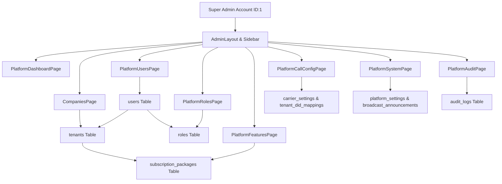

# Super Admin Feature Inventory & Specification — Yanosh-P Branch

**Repository:** `VishnuNagarajanS/sales_rep_app`  
**Application:** NexusSales Platform  
**Branch:** `Yanosh-P`  
**Audit Date:** October 2026  
**Auditor Mode:** Read-Only Codebase Audit & Architectural Trace  
**Target Document:** Reference Specification and Verification Checklist for Merged Code Audit

---

## 1. Executive Summary

This document provides an exhaustive, evidence-based inventory of all Super Admin features, frontend components, backend APIs, database entities, security controls, and operational workflows implemented on the `Yanosh-P` branch of NexusSales.

A teammate has merged the `Yanosh-P` branch and requires an exact checklist to verify whether every Super Admin capability was properly incorporated into their branch without regressions or omissions.

### Key Architectural Findings
1. **Dedicated Super Admin Architecture:** The Super Admin workspace is isolated from tenant-specific operations via a dedicated layout (`AdminLayout.tsx`), role-based routing guarded by `isSuperAdmin` (`user.role.code === 'super_admin'`), and specialized platform controllers under `/api/super-admin/`.
2. **Dual-Layer Data Resilience (API-First with Local Cache/Mock Fallback):** The frontend service layer (`superAdminService.ts`) implements an API-first pattern. When the backend REST API is running and connected to PostgreSQL (`neondb`), all mutations and queries execute against live database tables. If the backend is offline or encounters a network disruption, the service gracefully caches to and restores from browser `localStorage` (`nexus_admin_*` keys), falling back to baseline mock fixtures to prevent application crashes or blank screens.
3. **Strict Company Admin Creation Constraint:** The backend strictly enforces that **Super Admins can only create `company_admin` users** (`PlatformUsersController.cs:178-183`). Any attempt to provision lower-level roles (e.g., Sales Executive, Presales, Manager) via the Super Admin endpoint returns HTTP 400 Bad Request. Those operational roles must be created by their respective Company Admin within their tenant workspace.
4. **Root Protection Rules:** The platform enforces strict entity protection against deletion:
   - Root Super Admin user (`yanosh@ghlindiaventures.com`, ID 1) cannot be deleted (`PlatformUsersController.cs:382`).
   - Core tenants (Tenant ID 1: GHL India, Tenant ID 2: Jamin Ventures) cannot be deleted (`PlatformTenantsController.cs:277`).
   - Subscription packages actively assigned to one or more tenants (`enrolledCount > 0`) cannot be deleted (`PlatformPackagesController.cs:224`).
5. **Real Diagnostic & Telemetry Probes:** Backend diagnostics execute live OS and database queries:
   - Memory telemetry via `System.Diagnostics.Process.GetCurrentProcess().WorkingSet64` and `GC.GetTotalMemory()`.
   - Disk telemetry via `System.IO.DriveInfo`.
   - Database connection pool telemetry directly from PostgreSQL's `pg_stat_activity`.
   - Real TCP socket connection probes for SIP carrier IP/FQDN gateways and SMTP server ports.
   - Dynamic call metrics aggregation directly from `CallRecords` bounded by timezone-aware UTC day boundaries.
   - Dynamic lead aggregation with Month-over-Month calculation from `Leads`.

---

## 2. Complete Feature Inventory by Functional Domain

### Domain A: Super Admin Authentication, Session & Access Control
- **Super Admin Persona & Account:** Dedicated root account (`yanosh@ghlindiaventures.com`, `usr-super-01`, Role ID 1 `super_admin`).
- **One-Click Persona Switcher:** Super Admin quick-login selector in `PersonaSwitcher.tsx` and preset buttons in `AuthLayout.tsx`.
- **JWT & Role Claims:** Authentication tokens encode `role: "super_admin"`, evaluated by `AuthContext.tsx` as `isSuperAdmin = true`.
- **Session Revalidation & Persistence:** Automatic revalidation via `/api/auth/me` on tab focus/visibility change with cached identity fallback in `localStorage` (`user`, `token`, `user_role`).
- **Dedicated Layout & Route Protection:** `AdminLayout.tsx` enforces Super Admin isolation, rendering a distinct admin sidebar, global broadcast banner, maintenance alert bar, and network connectivity indicator. Non-super-admins attempting to access `/admin-*` are redirected.

### Domain B: Platform Dashboard & Telemetry (`PlatformDashboardPage.tsx`)
- **Key Metrics Grid (4 Stat Cards):**
  - *Total Leads Managed:* Live count aggregated from `_context.Leads.CountAsync()` across all tenants with Month-over-Month % change calculation.
  - *Aggregate Pipeline:* Cross-tenant pipeline financial value formatted in ₹ Crores/Lakhs with active deal counts.
  - *System Calls Today:* Real-time count of calls initiated today across all tenants, querying `_context.CallRecords` between midnight UTC and current time with 30-second live polling.
  - *Calls Connected & Rate:* Calls with disposition `completed` or duration > 0, calculating live connection percentage.
- **Fleet & System Health Panel:** Real-time indicator displaying health score (calculated from historical uptime checks in `platform_settings`), database latency (ms), API response latency, and active services count.
- **User Activity Distribution:** Bar and metric indicators showing active reps, company admins, and total registered users.
- **Recent Platform Activity Stream:** Real-time feed of recent cross-tenant tenant onboardings, admin creations, package updates, and carrier changes.
- **Quick Platform Actions:** Direct navigation shortcuts to Tenant Onboarding, Carrier Configuration, Role Manager, and System Diagnostics.

### Domain C: Cross-Tenant User Management (`PlatformUsersPage.tsx`)
- **Global User Directory:** Unified table of all users across all organizations and tenants.
- **Multi-Vector Search & Filters:** Real-time filtering by user name, email, phone number, organization/tenant, role, and active/inactive status.
- **User Statistics Header:** High-level counters for Total Users, Active Users, Company Admins, and Sales Representatives.
- **Company Admin Provisioning Modal:** Form strictly designated for creating Company Admins for specific tenants with email validation, tenant assignment, and temporary password generation.
- **User Status Toggle:** Live activation/deactivation of user accounts with immediate database persistence (`IsActive` flag).
- **Temporary Password Reset:** One-click password reset modal that generates a secure temporary password (`Nexus#<4-digits>!`), hashes it with BCrypt, saves it to the database, and presents it to the Super Admin.
- **User Deletion Protection:** Super Admin can delete non-critical users, with hardcoded protection preventing the deletion of the root Super Admin (`yanosh@ghlindiaventures.com`).

### Domain D: Tenant / Company Management (`CompaniesPage.tsx`)
- **Comprehensive Company Directory:** Table and card grid of all registered client organizations (tenants).
- **Tenant Metric Summaries:** Total Companies, Active Subscriptions, Total Platform Users, and Aggregate Leads.
- **New Tenant Provisioning Modal:**
  - Company details: Name, Slug, Domain, Industry, Support Email, Phone, Max Users limit.
  - Subscription Package Selection: Assignment of tiered packages (e.g., Wealth Advisory Enterprise Suite, Plotted Land Pro, Starter CRM).
  - Automated Company Admin Creation: Option to provision the tenant's first Company Admin in the same workflow.
  - DID Inbound Mapping: Optional assignment of an inbound phone number (DID) to the tenant.
- **Tenant Feature Package Upgrades:** Inline modal to reassign feature tiers to any tenant with instant database update.
- **Tenant Status Toggle:** Activate or suspend tenant organizations.
- **Tenant Protection:** Hard deletion restriction preventing removal of primary seeded tenants (GHL India, Jamin Ventures).

### Domain E: Feature Package & Tier Management (`PlatformFeaturesPage.tsx`)
- **Tier Configuration Cards:** Management of platform subscription packages (`subscription_packages` table).
- **Package Details:** Tier Name, Code, Price (₹/month), Max Users, Storage (GB), Features list, and Active Status.
- **Enrolled Tenant Count:** Dynamic calculation of how many companies are subscribed to each package.
- **Package Creation & Modification:** Create new tiers or update existing limits, pricing, and feature flags.
- **Deletion Safeguard:** Backend blocks deletion of any package that has 1 or more active tenant subscriptions.

### Domain F: Roles & Permissions Governance (`PlatformRolesPage.tsx`)
- **Role Catalog:** Cross-tenant role viewer for system roles (`super_admin`, `company_admin`, `sales_executive`, `presales_rep`, `sales_manager`).
- **Dynamic Permission Matrix:** Displays 28 granular platform permissions categorized into 7 operational groups:
  1. *Dashboard & Analytics* (e.g., `view_dashboard`, `view_analytics`, `export_reports`)
  2. *Lead Management* (e.g., `view_leads`, `create_leads`, `edit_leads`, `delete_leads`, `assign_leads`, `export_leads`)
  3. *Telephony & Calls* (e.g., `make_calls`, `view_call_history`, `listen_recordings`, `manage_call_config`)
  4. *Customer Operations* (e.g., `view_customers`, `edit_customers`)
  5. *User & Organization* (e.g., `manage_users`, `manage_teams`, `manage_organization`)
  6. *Platform Administration* (e.g., `manage_tenants`, `manage_packages`, `manage_platform_settings`, `manage_roles`)
  7. *System & Security* (e.g., `view_audit_logs`, `manage_security`, `view_system_health`)
- **Role Creation Modal:** Allows creating custom tenant-level roles with specific assigned permission IDs.
- **Role Permission Assignment:** Modifying permissions for existing roles.

### Domain G: Platform Call Configuration & Telephony Telemetry (`PlatformCallConfigPage.tsx`)
- **Primary Carrier SIP Trunk Settings:**
  - Carrier selection (Twilio Elastic SIP Trunk, Exotel, Tata Tele, Custom Asterisk/FreeSWITCH).
  - Trunk Host/IP, Port (5060/5061), Transport protocol (UDP/TCP/TLS), Audio Codec (G.711u, G.711a, G.729, Opus).
  - Authentication credentials (Username, Password / Auth Token, IP Access Control List).
  - Concurrent Call Channel Limits and Max Call Duration enforcement.
- **Failover Redundancy Trunk:**
  - Automatic failover toggle.
  - Failover carrier host, port, timeout (ms), and max retry attempts before triggering operator alert.
- **AI Speech-to-Text & Transcription Engine:**
  - Provider selection (Deepgram Nova-2, Whisper AI, Google Cloud Speech, Azure Cognitive).
  - Language model selection (English-India, English-US, Hindi-English mixed).
  - PII redaction and live interim transcript toggles.
- **DID Inbound Number Routing Inventory:**
  - Table of all assigned DIDs, their assigned tenant company, fallback target, and active status.
  - DID assignment and editing modal.
- **Live Carrier Connectivity Socket Test:** Frontend button triggering real backend TCP socket probe to verify carrier SIP gateway latency.
- **Inbound Call Routing Simulator:** Interactive debugging tool allowing Super Admin to input a caller number and DID, tracing the exact tenant, routing rule, and available sales agents in real-time from the database.

### Domain H: System Diagnostics, Health & Operations (`PlatformSystemPage.tsx`)
- **System Health Overview (Real Diagnostics):**
  - *API Server Health:* Uptime duration, CPU process load, memory consumption (`WorkingSet64` in MB), GC memory, thread counts.
  - *PostgreSQL Database Health:* Connection latency in milliseconds, active connection count, idle connection count, and transaction state queried from `pg_stat_activity`.
  - *Storage & Disk Health:* Free space and total capacity queried via `DriveInfo`.
- **Diagnostic Probes & Tests:**
  - Real DB query latency probe.
  - Real API roundtrip ping test.
  - Real SMTP Mail Server TCP socket probe (`PlatformSystemController.cs:health-checks/smtp/test`).
- **Global Platform Configuration Editor:**
  - Platform Name, Support Contact Email, Default Timezone (IST `Asia/Kolkata`).
  - Max Login Attempts before lockout, Session Timeout (minutes).
  - Enforcement of Two-Factor Authentication (2FA) policy.
  - Database persistence via key-value store in `platform_settings` table.
- **Maintenance Mode Switch:**
  - Platform-wide emergency maintenance toggle.
  - Broadcasts immediate maintenance alert banner across all active user sessions.
  - Persists state into `platform_settings` under key `maintenance_mode`.
- **Global Broadcast Announcements:**
  - Create and manage platform-wide banner announcements.
  - Target audience selection: `all_users`, `company_admins_only`, `sales_reps_only`.
  - Announcement types: `info`, `warning`, `critical`, `maintenance`.
  - Expiration dates and instant activation. Active banners render at the top of `AdminLayout.tsx`.
- **Full Platform JSON Backup Export:**
  - One-click backup export button (`/api/super-admin/system/backup/export`).
  - Queries all tenants, packages, users, carrier configs, announcements, and platform settings.
  - Generates a downloadable, timestamped JSON snapshot and logs `last_platform_backup_at`.

### Domain I: Platform Audit & Compliance Logging (`PlatformAuditPage.tsx`)
- **Cross-Tenant Audit Trail:** Comprehensive event log tracking administrative actions across the platform.
- **Filtering & Search:** Filter by Action Type (`CREATE`, `UPDATE`, `DELETE`, `AUTH`, `SECURITY`, `CONFIG`), Organization/Tenant, Severity (`INFO`, `WARNING`, `CRITICAL`), and Date Range.
- **Event Detail Inspector:** Modal showing full JSON payload of changes (old value vs. new value), actor IP address, user agent, and timestamp.
- **Export Capability:** Export filtered audit trails to CSV/JSON for compliance reporting.

---

## 3. Detailed Page-by-Page Functionality

### 1. Platform Dashboard (`PlatformDashboardPage.tsx`)
- **Route:** `/admin-dashboard` or `/dashboard` (when logged in as Super Admin)
- **Component File:** `frontend/src/pages/super-admin/PlatformDashboardPage.tsx`
- **Data Hook / Service:** `superAdminService.getPlatformMetrics()`, `superAdminService.getCallsTodayLive()`
- **UI Elements:**
  - Top header with "System Live" pulse indicator and manual Refresh button.
  - 4 Stat Cards: Total Leads Managed, Aggregate Pipeline Value, Calls Today, Calls Connected.
  - Fleet Health Card: Health Score %, API Latency (ms), Database Status, Active Microservices count.
  - User Composition Card: Progress bar visualization of Active Reps vs. Company Admins.
  - System Telemetry Breakdown: Carrier SIP trunk status badge, Failover readiness badge, Speech-to-Text provider badge.
  - Recent Activity Feed: List of last 6 administrative events with tenant logos and relative timestamps.
  - Quick Action Shortcuts: Buttons linking to `/admin-companies`, `/admin-call-config`, `/admin-roles`, `/admin-system`.

### 2. Companies / Tenant Management (`CompaniesPage.tsx`)
- **Route:** `/admin-companies`
- **Component File:** `frontend/src/pages/super-admin/CompaniesPage.tsx`
- **Data Hook / Service:** `superAdminService.getTenants()`, `superAdminService.createTenant()`, `superAdminService.updateTenantStatus()`, `superAdminService.deleteTenant()`, `superAdminService.getSubscriptionPackages()`, `superAdminService.assignTenantPackage()`
- **UI Elements:**
  - Metric summary chips: Total Companies, Active Subscriptions, Total Platform Users, Aggregate Leads.
  - Search bar (by company name, domain, slug) and Status Filter (All, Active, Suspended, Provisioning).
  - Companies Table:
    - Columns: Company Name & Slug, Domain, Feature Package Tier Badge, Assigned DID, Total Users, Created Date, Status Switch, Actions.
    - Actions: Edit Company, Change Package, Manage DIDs, Suspend/Activate, Delete.
  - Modal: "Create New Company" with two-phase workflow (Company Information + Optional First Company Admin + DID assignment).
  - Modal: "Change Subscription Package" with radio buttons for all active packages.

### 3. Cross-Tenant User Management (`PlatformUsersPage.tsx`)
- **Route:** `/admin-users`
- **Component File:** `frontend/src/pages/super-admin/PlatformUsersPage.tsx`
- **Data Hook / Service:** `superAdminService.getUsers()`, `superAdminService.createCompanyAdmin()`, `superAdminService.updateUserStatus()`, `superAdminService.resetUserPassword()`, `superAdminService.deleteUser()`, `superAdminService.getTenants()`
- **UI Elements:**
  - Stat counters: Total Users, Active Accounts, Company Admins, Sales Reps.
  - Search input: Real-time search across Name, Email, Phone.
  - Filters: Organization Dropdown, Role Filter (Super Admin, Company Admin, Sales Executive, etc.), Status Filter (Active, Inactive).
  - Users Data Table:
    - User Avatar & Name, Email & Phone, Organization Tag, Role Badge, Status Toggle, Joined Date, Actions Menu.
    - Actions Menu: Reset Temporary Password, Toggle Status, Delete User.
  - Modal: "Create Company Admin":
    - Strict validation: Organization selection (required), Full Name, Email, Phone.
    - Explicit helper notice: *"Super Admins provision Company Admins. Sales reps and staff are managed by their respective Company Admin."*
  - Modal: "Password Reset Result":
    - Displays newly generated temporary password with a 1-click copy-to-clipboard button.

### 4. Roles & Permissions Catalog (`PlatformRolesPage.tsx`)
- **Route:** `/admin-roles`
- **Component File:** `frontend/src/pages/super-admin/PlatformRolesPage.tsx`
- **Data Hook / Service:** `superAdminService.getRoles()`, `superAdminService.getPermissions()`, `superAdminService.createRole()`, `superAdminService.updateRole()`
- **UI Elements:**
  - Left Panel: Role List (System Roles vs. Tenant Roles) with user counts per role.
  - Right Panel: Detailed Permission Matrix for the selected role.
  - 7 Collapsible Category Cards (Dashboard, Leads, Calls, Customers, User Ops, Platform Admin, Security) showing checkboxes for all 28 permissions.
  - "Create Custom Role" button and modal with multi-select permission picker.

### 5. Feature Packages & Tiers (`PlatformFeaturesPage.tsx`)
- **Route:** `/admin-features`
- **Component File:** `frontend/src/pages/super-admin/PlatformFeaturesPage.tsx`
- **Data Hook / Service:** `superAdminService.getSubscriptionPackages()`, `superAdminService.createPackage()`, `superAdminService.updatePackage()`, `superAdminService.deletePackage()`
- **UI Elements:**
  - Package Cards Grid: Shows package name, monthly price, max user threshold, storage quota, enrolled tenant count, and list of included feature flags.
  - "New Feature Package" modal: Configure Tier Name, Code, Max Users, Storage, Price, and toggles for Call Recording, AI Insights, WhatsApp Integration, Multi-SIP Trunks.
  - Inline Edit / Delete options (with enrolled tenant protection).

### 6. Carrier & Call Telemetry Configuration (`PlatformCallConfigPage.tsx`)
- **Route:** `/admin-call-config`
- **Component File:** `frontend/src/pages/super-admin/PlatformCallConfigPage.tsx`
- **Data Hook / Service:** `superAdminService.getCarrierConfig()`, `superAdminService.saveCarrierConfig()`, `superAdminService.testCarrierConnection()`, `superAdminService.simulateCallRouting()`, `superAdminService.getTenantDids()`
- **UI Elements:**
  - Tab 1: Primary SIP Trunk (Carrier selection, host, port, protocol, credentials, channel limit).
  - Tab 2: Failover & Redundancy (Failover toggle, secondary host, retry thresholds).
  - Tab 3: Speech-to-Text AI (Engine provider, language, PII redaction).
  - Tab 4: Inbound DIDs (Directory of all mapped phone numbers across tenants).
  - Interactive Action: "Test Gateway Connection" — initiates real backend socket check and displays latency in milliseconds.
  - Interactive Action: "Simulate Inbound Call" — inputs caller phone and target DID; displays real-time execution trace of routing logic.

### 7. System Health & Operations (`PlatformSystemPage.tsx`)
- **Route:** `/admin-system`
- **Component File:** `frontend/src/pages/super-admin/PlatformSystemPage.tsx`
- **Data Hook / Service:** `superAdminService.getSystemHealth()`, `superAdminService.getSystemDiagnostics()`, `superAdminService.testDatabaseConnection()`, `superAdminService.testApiHealth()`, `superAdminService.testSmtpConnection()`, `superAdminService.getGlobalConfig()`, `superAdminService.saveGlobalConfig()`, `superAdminService.getAnnouncements()`, `superAdminService.createAnnouncement()`, `superAdminService.deleteAnnouncement()`, `superAdminService.toggleMaintenanceMode()`, `superAdminService.exportPlatformBackup()`
- **UI Elements:**
  - Live Diagnostics Grid: Server Uptime, Process Memory (`WorkingSet64`), GC Memory, Active DB Pool Connections, Free Disk Space.
  - Probe Testing Bar: Three buttons for "Probe Database Latency", "Ping API Latency", and "Test SMTP Socket".
  - Emergency Maintenance Toggle: Switch that activates platform-wide maintenance mode with confirmation prompt.
  - Broadcast Announcements Manager: Form to compose banner messages with severity, target role, and expiry date, plus table of active announcements with delete action.
  - Global Platform Configuration Card: Editable fields for Platform Name, Support Email, Timezone, Session Timeout, Max Login Attempts, and 2FA Requirement.
  - Platform Data Backup Card: "Export Complete Platform Backup" button that triggers a JSON download of all platform configuration.

### 8. Audit & Compliance Trail (`PlatformAuditPage.tsx`)
- **Route:** `/admin-audit`
- **Component File:** `frontend/src/pages/super-admin/PlatformAuditPage.tsx`
- **Data Hook / Service:** `superAdminService.getAuditLogs()`, `superAdminService.getTenants()`
- **UI Elements:**
  - Filter Bar: Date Range Picker, Action Type Dropdown, Organization Dropdown, Severity Filter.
  - Audit Trail Table: Timestamp, Actor Name & Email, Organization, Action, Target Entity, Severity Badge, IP Address.
  - Payload Inspector Drawer: Clicking any log row slides out the full change diff and request metadata.
  - Export CSV Button: Generates filtered audit log spreadsheet.

---

## 4. End-to-End User Workflows and Actions

### Workflow 1: Onboarding a New Company Tenant & Provisioning its Admin
1. Super Admin navigates to `/admin-companies` and clicks **"+ Onboard New Company"**.
2. Fills in Company Name (e.g., "Skyline Realty"), Slug ("skyline"), Domain ("skylinerealty.com"), and Max Users (25).
3. Selects Subscription Package (e.g., "Wealth Advisory Enterprise Suite").
4. Toggles **"Provision Initial Company Admin"**:
   - Inputs Admin Name ("Priya Sharma"), Admin Email ("priya@skylinerealty.com"), Phone ("+91 98765 43210").
5. Optional: Assigns an Inbound DID ("+918045678901").
6. Submits form.
7. Frontend calls `superAdminService.createTenant(payload)` -> `POST /api/super-admin/tenants`.
8. Backend transactionally:
   - Validates uniqueness of company name and slug.
   - Inserts record into `tenants` table.
   - Automatically generates a temporary password for the new Company Admin (`Nexus#<random>!`).
   - Inserts new user record into `users` table linked to the new `tenant_id` with `role_id = 2` (`company_admin`).
   - Inserts record into `tenant_did_mappings` table.
   - Writes an audit log record into `audit_logs`.
9. Response returns created tenant object and the generated admin credentials.
10. UI updates the table and displays an onboarding success dialog showing the admin's temporary password.

### Workflow 2: Provisioning an Additional Company Admin
1. Super Admin navigates to `/admin-users` and clicks **"+ Add Company Admin"**.
2. Selects the target Tenant organization from the dropdown.
3. Inputs Admin Name, Email, and Phone.
4. Submits form.
5. Frontend calls `superAdminService.createCompanyAdmin(payload)` -> `POST /api/super-admin/users`.
6. Backend verifies caller is Super Admin and strictly enforces `requestedRole == "company_admin"`.
7. Checks if user email already exists; returns 409 Conflict if taken.
8. Hashes temporary password with BCrypt, saves user to `users` table with `RoleId = 2`.
9. Logs event to `audit_logs`.
10. Response returns created user object with `temporaryPassword`.
11. UI displays the temporary password modal with one-click copy button.

### Workflow 3: Upgrading a Tenant's Feature Package
1. Super Admin navigates to `/admin-companies`.
2. Locates target company (e.g., "GHL India" or "Jamin Ventures") and clicks the **"Change Package"** action.
3. Modal displays all available packages from `subscription_packages`.
4. Selects new tier (e.g., "Wealth Advisory Enterprise Suite").
5. Submits change.
6. Frontend calls `superAdminService.assignTenantPackage(tenantId, packageId)` -> `PUT /api/super-admin/tenants/{id}/package`.
7. Backend updates `subscription_package_id` in `tenants` table and writes audit log.
8. UI updates the package badge on the company card immediately.

### Workflow 4: Real-Time Carrier Gateway Diagnostics
1. Super Admin navigates to `/admin-call-config`.
2. Views the Primary SIP Trunk configuration parameters (Host, Port, Codec).
3. Clicks **"Test Gateway Connection"**.
4. Frontend calls `superAdminService.testCarrierConnection()` -> `POST /api/super-admin/call-config/carrier/test`.
5. Backend opens a direct TCP stream probe to `CarrierSettings.PrimaryHost:PrimaryPort` with a 3000ms timeout.
6. Calculates elapsed round-trip latency in milliseconds.
7. Backend returns `{ success: true, latencyMs: 42, carrier: "Twilio Elastic SIP Trunk", host: "sip.pstn.twilio.com" }`.
8. UI displays a green success badge with the measured ping latency.

### Workflow 5: Emergency Platform Maintenance Activation
1. Super Admin navigates to `/admin-system`.
2. Flips the **"Platform Maintenance Mode"** switch to ON.
3. Confirmation dialog appears warning that all non-super-admin users will see an active maintenance barrier.
4. Confirms activation.
5. Frontend calls `superAdminService.toggleMaintenanceMode(true)` -> `PUT /api/super-admin/system/maintenance`.
6. Backend writes key `maintenance_mode = "true"` into `platform_settings` table.
7. Writes a critical audit log entry into `audit_logs`.
8. `AdminLayout.tsx` and all user layouts read the active platform state and immediately render the top maintenance warning banner.

---

## 5. Frontend File Inventory

### Pages & Views (`frontend/src/pages/super-admin/`)
| File Path | Description | Key Imports & Hooks |
|---|---|---|
| `frontend/src/pages/super-admin/PlatformDashboardPage.tsx` | Platform overview dashboard with 4 metric cards, fleet health, user stats, and quick actions | `superAdminService`, `Lucide Icons`, `framer-motion` |
| `frontend/src/pages/super-admin/CompaniesPage.tsx` | Tenant company directory, creation modal, status toggle, package assignment | `superAdminService`, `Tenant`, `SubscriptionPackage` |
| `frontend/src/pages/super-admin/PlatformUsersPage.tsx` | Cross-tenant user management, Company Admin creation modal, password reset modal | `superAdminService`, `User`, `Role` |
| `frontend/src/pages/super-admin/PlatformRolesPage.tsx` | System and tenant role management, 28-permission dynamic matrix | `superAdminService`, `Role`, `Permission` |
| `frontend/src/pages/super-admin/PlatformFeaturesPage.tsx` | Subscription package management, pricing, limits, feature flag configuration | `superAdminService`, `SubscriptionPackage` |
| `frontend/src/pages/super-admin/PlatformCallConfigPage.tsx` | SIP trunk, failover, STT engine, DIDs, socket test, call routing simulator | `superAdminService`, `CarrierSettings`, `TenantDidMapping` |
| `frontend/src/pages/super-admin/PlatformSystemPage.tsx` | Diagnostics, DB/API/SMTP probes, maintenance mode, broadcasts, config, backup | `superAdminService`, `SystemDiagnostics`, `PlatformSettings` |
| `frontend/src/pages/super-admin/PlatformAuditPage.tsx` | Cross-tenant audit log viewer, filtering, payload drawer, CSV export | `superAdminService`, `AuditLog` |

### Layout & Navigation Components
| File Path | Description |
|---|---|
| `frontend/src/layouts/AdminLayout.tsx` | Dedicated Super Admin wrapper rendering sidebar, topbar, broadcast banner, and maintenance badge |
| `frontend/src/components/layout/Sidebar.tsx` | Admin navigation menu containing 8 Super Admin route items (lines 131–144) |
| `frontend/src/components/layout/TopBar.tsx` | Top bar with role badge, user avatar, notifications, and profile menu |
| `frontend/src/components/auth/PersonaSwitcher.tsx` | Quick persona switcher featuring Yanosh (Super Admin) preset |
| `frontend/src/pages/auth/AuthLayout.tsx` | Login screen with pre-filled one-click demo login buttons |

### Service & API Layer
| File Path | Description |
|---|---|
| `frontend/src/services/superAdminService.ts` | 50+ API-first service functions calling backend `/api/super-admin/*` with `localStorage` caching and fallback |
| `frontend/src/services/apiClient.ts` | Axios instance with JWT interceptor, error handling, and base URL configuration |
| `frontend/src/contexts/AuthContext.tsx` | Context holding user session, JWT token, `isSuperAdmin` boolean flag, and session revalidation |

---

## 6. Complete Backend API Inventory

All Super Admin endpoints are implemented across 7 ASP.NET Core controllers in `backend/Controllers/`:

### Controller 1: `PlatformUsersController.cs`
**File Path:** `backend/Controllers/SuperAdmin/PlatformUsersController.cs`  
**Base Route:** `/api/super-admin/users`  
**Authorization Policy:** `[Authorize(Roles = "super_admin")]`

| HTTP Method | Route | Action Method | Request DTO | Response Structure | DB Entities Accessed | Frontend Caller | Status |
|---|---|---|---|---|---|---|---|
| `GET` | `/api/super-admin/users` | `GetUsers` | Query params: `tenantId`, `role`, `status`, `search` | `List<PlatformUserDto>` | `Users`, `Roles`, `Tenants` | `superAdminService.getUsers` | **PRESENT** |
| `GET` | `/api/super-admin/users/{id}` | `GetUserById` | Route `id` (int) | `PlatformUserDto` | `Users`, `Roles`, `Tenants` | `superAdminService.getUserById` | **PRESENT** |
| `POST` | `/api/super-admin/users` | `CreateCompanyAdmin` | `CreateCompanyAdminRequest` (Name, Email, Phone, TenantId) | `PlatformUserDto` + `temporaryPassword` | `Users`, `Roles`, `Tenants`, `AuditLogs` | `superAdminService.createCompanyAdmin` | **PRESENT** (Strict `company_admin` only) |
| `PUT` | `/api/super-admin/users/{id}/status` | `UpdateUserStatus` | `UpdateUserStatusRequest` (`isActive`) | `PlatformUserDto` | `Users`, `AuditLogs` | `superAdminService.updateUserStatus` | **PRESENT** |
| `POST` | `/api/super-admin/users/{id}/reset-password` | `ResetPassword` | Route `id` | `{ temporaryPassword: string }` | `Users`, `AuditLogs` | `superAdminService.resetUserPassword` | **PRESENT** |
| `DELETE` | `/api/super-admin/users/{id}` | `DeleteUser` | Route `id` | `204 NoContent` | `Users`, `AuditLogs` | `superAdminService.deleteUser` | **PRESENT** (Yanosh protected) |
| `GET` | `/api/super-admin/users/metrics` | `GetUserMetrics` | None | `{ totalUsers, activeUsers, companyAdmins, salesReps }` | `Users`, `Roles` | `superAdminService.getUserMetrics` | **PRESENT** |
| `GET` | `/api/super-admin/users/metrics/calls-today` | `GetLiveCallsToday` | None | `{ callsToday, callsConnected, connectionRate, queriedAt }` | `CallRecords` | `superAdminService.getCallsTodayLive` | **PRESENT** (30s polling) |

### Controller 2: `PlatformTenantsController.cs`
**File Path:** `backend/Controllers/SuperAdmin/PlatformTenantsController.cs`  
**Base Route:** `/api/super-admin/tenants`  
**Authorization Policy:** `[Authorize(Roles = "super_admin")]`

| HTTP Method | Route | Action Method | Request DTO | Response Structure | DB Entities Accessed | Frontend Caller | Status |
|---|---|---|---|---|---|---|---|
| `GET` | `/api/super-admin/tenants` | `GetTenants` | Query params: `status`, `search` | `List<TenantDetailDto>` | `Tenants`, `SubscriptionPackages`, `Users`, `TenantDidMappings` | `superAdminService.getTenants` | **PRESENT** |
| `GET` | `/api/super-admin/tenants/{id}` | `GetTenantById` | Route `id` (int) | `TenantDetailDto` | `Tenants`, `SubscriptionPackages`, `Users`, `TenantDidMappings` | `superAdminService.getTenantById` | **PRESENT** |
| `POST` | `/api/super-admin/tenants` | `CreateTenant` | `CreateTenantRequest` (Name, Slug, Domain, PackageId, AdminDetails, Did) | `TenantDetailDto` | `Tenants`, `SubscriptionPackages`, `Users`, `TenantDidMappings`, `AuditLogs` | `superAdminService.createTenant` | **PRESENT** |
| `PUT` | `/api/super-admin/tenants/{id}/status` | `UpdateTenantStatus` | `UpdateTenantStatusRequest` (`status`) | `TenantDetailDto` | `Tenants`, `AuditLogs` | `superAdminService.updateTenantStatus` | **PRESENT** |
| `PUT` | `/api/super-admin/tenants/{id}/package` | `AssignPackage` | `AssignPackageRequest` (`packageId`) | `TenantDetailDto` | `Tenants`, `SubscriptionPackages`, `AuditLogs` | `superAdminService.assignTenantPackage` | **PRESENT** |
| `DELETE` | `/api/super-admin/tenants/{id}` | `DeleteTenant` | Route `id` | `204 NoContent` | `Tenants`, `AuditLogs` | `superAdminService.deleteTenant` | **PRESENT** (Root tenants protected) |

### Controller 3: `PlatformPackagesController.cs`
**File Path:** `backend/Controllers/SuperAdmin/PlatformPackagesController.cs`  
**Base Route:** `/api/super-admin/packages`  
**Authorization Policy:** `[Authorize(Roles = "super_admin")]`

| HTTP Method | Route | Action Method | Request DTO | Response Structure | DB Entities Accessed | Frontend Caller | Status |
|---|---|---|---|---|---|---|---|
| `GET` | `/api/super-admin/packages` | `GetPackages` | None | `List<SubscriptionPackageDto>` (with `enrolledCount`) | `SubscriptionPackages`, `Tenants` | `superAdminService.getSubscriptionPackages` | **PRESENT** |
| `GET` | `/api/super-admin/packages/{id}` | `GetPackageById` | Route `id` (int) | `SubscriptionPackageDto` | `SubscriptionPackages`, `Tenants` | `superAdminService.getPackageById` | **PRESENT** |
| `POST` | `/api/super-admin/packages` | `CreatePackage` | `CreatePackageRequest` | `SubscriptionPackageDto` | `SubscriptionPackages`, `AuditLogs` | `superAdminService.createPackage` | **PRESENT** |
| `PUT` | `/api/super-admin/packages/{id}` | `UpdatePackage` | `UpdatePackageRequest` | `SubscriptionPackageDto` | `SubscriptionPackages`, `AuditLogs` | `superAdminService.updatePackage` | **PRESENT** |
| `DELETE` | `/api/super-admin/packages/{id}` | `DeletePackage` | Route `id` | `204 NoContent` | `SubscriptionPackages`, `Tenants`, `AuditLogs` | `superAdminService.deletePackage` | **PRESENT** (Enrolled count check) |
| `GET` | `/api/super-admin/packages/{id}/tenants` | `GetEnrolledTenants` | Route `id` | `List<TenantSummaryDto>` | `Tenants` | `superAdminService.getPackageTenants` | **PRESENT** |

### Controller 4: `PlatformRolesController.cs`
**File Path:** `backend/Controllers/SuperAdmin/PlatformRolesController.cs`  
**Base Route:** `/api/super-admin/roles`  
**Authorization Policy:** `[Authorize(Roles = "super_admin")]`

| HTTP Method | Route | Action Method | Request DTO | Response Structure | DB Entities Accessed | Frontend Caller | Status |
|---|---|---|---|---|---|---|---|
| `GET` | `/api/super-admin/roles` | `GetRoles` | None | `List<RoleWithPermissionsDto>` | `Roles`, `Users` | `superAdminService.getRoles` | **PRESENT** |
| `GET` | `/api/super-admin/roles/{id}` | `GetRoleById` | Route `id` | `RoleWithPermissionsDto` | `Roles`, `Users` | `superAdminService.getRoleById` | **PRESENT** |
| `POST` | `/api/super-admin/roles` | `CreateRole` | `CreateRoleRequest` | `RoleWithPermissionsDto` | `Roles`, `AuditLogs` | `superAdminService.createRole` | **PRESENT** |
| `PUT` | `/api/super-admin/roles/{id}` | `UpdateRole` | `UpdateRoleRequest` | `RoleWithPermissionsDto` | `Roles`, `AuditLogs` | `superAdminService.updateRole` | **PRESENT** |
| `DELETE` | `/api/super-admin/roles/{id}` | `DeleteRole` | Route `id` | `204 NoContent` | `Roles`, `Users`, `AuditLogs` | `superAdminService.deleteRole` | **PRESENT** (System roles protected) |
| `GET` | `/api/super-admin/roles/permissions` | `GetPermissionsCatalog` | None | `List<PermissionCategoryDto>` (7 groups, 28 items) | In-memory verified catalog | `superAdminService.getPermissions` | **PRESENT** |
| `PUT` | `/api/super-admin/roles/{id}/permissions` | `AssignPermissions` | `AssignPermissionsRequest` | `RoleWithPermissionsDto` | `Roles`, `AuditLogs` | `superAdminService.assignRolePermissions` | **PRESENT** |

### Controller 5: `PlatformCallConfigController.cs`
**File Path:** `backend/Controllers/SuperAdmin/PlatformCallConfigController.cs`  
**Base Route:** `/api/super-admin/call-config`  
**Authorization Policy:** `[Authorize(Roles = "super_admin")]`

| HTTP Method | Route | Action Method | Request DTO | Response Structure | DB Entities Accessed | Frontend Caller | Status |
|---|---|---|---|---|---|---|---|
| `GET` | `/api/super-admin/call-config/carrier` | `GetCarrierSettings` | None | `CarrierSettingsDto` | `CarrierSettings` | `superAdminService.getCarrierConfig` | **PRESENT** |
| `PUT` | `/api/super-admin/call-config/carrier` | `UpdateCarrierSettings` | `UpdateCarrierSettingsRequest` | `CarrierSettingsDto` | `CarrierSettings`, `AuditLogs` | `superAdminService.saveCarrierConfig` | **PRESENT** |
| `POST` | `/api/super-admin/call-config/carrier/test` | `TestCarrierConnection` | None | `{ success, latencyMs, carrier, host }` | `CarrierSettings` (Live TCP probe) | `superAdminService.testCarrierConnection` | **PRESENT** (Live socket test) |
| `GET` | `/api/super-admin/call-config/dids` | `GetTenantDids` | Query param: `tenantId` | `List<TenantDidMappingDto>` | `TenantDidMappings`, `Tenants` | `superAdminService.getTenantDids` | **PRESENT** |
| `POST` | `/api/super-admin/call-config/dids` | `CreateTenantDid` | `CreateTenantDidRequest` | `TenantDidMappingDto` | `TenantDidMappings`, `AuditLogs` | `superAdminService.createTenantDid` | **PRESENT** |
| `PUT` | `/api/super-admin/call-config/dids/{id}` | `UpdateTenantDid` | `UpdateTenantDidRequest` | `TenantDidMappingDto` | `TenantDidMappings`, `AuditLogs` | `superAdminService.updateTenantDid` | **PRESENT** |
| `DELETE` | `/api/super-admin/call-config/dids/{id}` | `DeleteTenantDid` | Route `id` | `204 NoContent` | `TenantDidMappings`, `AuditLogs` | `superAdminService.deleteTenantDid` | **PRESENT** |
| `POST` | `/api/super-admin/call-config/simulate-call` | `SimulateCallRouting` | `{ callerNumber, dialedDid }` | `SimulateCallResultDto` | `TenantDidMappings`, `Tenants`, `Users` | `superAdminService.simulateCallRouting` | **PRESENT** (Traces live agents) |

### Controller 6: `PlatformSystemController.cs`
**File Path:** `backend/Controllers/SuperAdmin/PlatformSystemController.cs`  
**Base Route:** `/api/super-admin/system`  
**Authorization Policy:** `[Authorize(Roles = "super_admin")]`

| HTTP Method | Route | Action Method | Request DTO | Response Structure | DB Entities Accessed | Frontend Caller | Status |
|---|---|---|---|---|---|---|---|
| `GET` | `/api/super-admin/system/health` | `GetSystemHealth` | None | `SystemHealthDto` (score, uptime, db, api, storage) | `PlatformSettings` (telemetry history) | `superAdminService.getSystemHealth` | **PRESENT** |
| `GET` | `/api/super-admin/system/diagnostics` | `GetDiagnostics` | None | `SystemDiagnosticsDto` (process mem, GC, disk, db connections) | `pg_stat_activity`, `Process`, `DriveInfo` | `superAdminService.getSystemDiagnostics` | **PRESENT** (Live OS/PG stats) |
| `POST` | `/api/super-admin/system/diagnostics/database` | `TestDatabase` | None | `{ success, latencyMs, activeConnections }` | Live PG ping & `pg_stat_activity` | `superAdminService.testDatabaseConnection` | **PRESENT** |
| `POST` | `/api/super-admin/system/diagnostics/api` | `TestApi` | None | `{ success, latencyMs, timestamp }` | In-memory benchmark | `superAdminService.testApiHealth` | **PRESENT** |
| `POST` | `/api/super-admin/system/health-checks/smtp/test` | `TestSmtp` | None | `{ success, latencyMs, server, port }` | Live TCP socket probe | `superAdminService.testSmtpConnection` | **PRESENT** |
| `GET` | `/api/super-admin/system/config` | `GetGlobalConfig` | None | `GlobalPlatformConfigDto` | `PlatformSettings` | `superAdminService.getGlobalConfig` | **PRESENT** |
| `PUT` | `/api/super-admin/system/config` | `SaveGlobalConfig` | `GlobalPlatformConfigDto` | `GlobalPlatformConfigDto` | `PlatformSettings`, `AuditLogs` | `superAdminService.saveGlobalConfig` | **PRESENT** |
| `GET` | `/api/super-admin/system/maintenance` | `GetMaintenanceStatus` | None | `{ maintenanceMode: bool }` | `PlatformSettings` | `superAdminService.getMaintenanceStatus` | **PRESENT** |
| `PUT` | `/api/super-admin/system/maintenance` | `ToggleMaintenance` | `{ enabled: bool }` | `{ maintenanceMode: bool }` | `PlatformSettings`, `AuditLogs` | `superAdminService.toggleMaintenanceMode` | **PRESENT** |
| `GET` | `/api/super-admin/system/announcements` | `GetAnnouncements` | None | `List<AnnouncementDto>` | `BroadcastAnnouncements` | `superAdminService.getAnnouncements` | **PRESENT** |
| `GET` | `/api/super-admin/system/announcements/active` | `GetActiveAnnouncement` | None | `AnnouncementDto` or `null` | `BroadcastAnnouncements` | `AdminLayout.tsx` | **PRESENT** |
| `POST` | `/api/super-admin/system/announcements` | `CreateAnnouncement` | `CreateAnnouncementRequest` | `AnnouncementDto` | `BroadcastAnnouncements`, `AuditLogs` | `superAdminService.createAnnouncement` | **PRESENT** |
| `DELETE` | `/api/super-admin/system/announcements/{id}` | `DeleteAnnouncement` | Route `id` | `204 NoContent` | `BroadcastAnnouncements`, `AuditLogs` | `superAdminService.deleteAnnouncement` | **PRESENT** |
| `GET` | `/api/super-admin/system/backup/export` | `ExportBackup` | None | `PlatformBackupSnapshotDto` | All platform tables | `superAdminService.exportPlatformBackup` | **PRESENT** |

### Controller 7: `AuditLogsController.cs`
**File Path:** `backend/Controllers/AuditLogsController.cs`  
**Base Route:** `/api/audit-logs`  
**Authorization Policy:** `[Authorize]` (Company-scoped for tenant admins; cross-tenant + global for Super Admin)

| HTTP Method | Route | Action Method | Request Parameters | Response Structure | DB Entities Accessed | Frontend Caller | Status |
|---|---|---|---|---|---|---|---|
| `GET` | `/api/audit-logs` | `GetAuditLogs` | `companyId`, `action`, `startDate`, `endDate`, `limit` | `List<AuditLogDto>` | `AuditLogs`, `Users`, `Tenants` | `superAdminService.getAuditLogs` | **PRESENT** |

---

## 7. Database Entities, Schema and Migrations

### Migration Reference
- **Migration Name:** `20260930063941_AddSuperAdminEntitiesAndSettings`
- **File:** `backend/Migrations/20260930063941_AddSuperAdminEntitiesAndSettings.cs`
- **Snapshot File:** `backend/Migrations/ApplicationDbContextModelSnapshot.cs`

### Super Admin Entity Catalog

#### 1. `Tenant` (`tenants`)
- **Model:** `backend/Entities/Tenant.cs`
- **Primary Key:** `Id` (int, Identity)
- **Fields:** `Name` (varchar 200), `Slug` (varchar 100, Unique), `Domain` (varchar 200), `Industry` (varchar 100), `SupportEmail` (varchar 200), `Phone` (varchar 50), `MaxUsers` (int), `SubscriptionPackageId` (int, FK), `Status` (varchar 50), `CreatedAt` (timestamp), `UpdatedAt` (timestamp)
- **Relationships:** BelongsTo `SubscriptionPackage`; HasMany `Users`, `TenantDidMappings`
- **Protected Records:** ID 1 (`ghl`) and ID 2 (`jamin`)

#### 2. `SubscriptionPackage` (`subscription_packages`)
- **Model:** `backend/Entities/SubscriptionPackage.cs`
- **Primary Key:** `Id` (int, Identity)
- **Fields:** `Name` (varchar 150), `Code` (varchar 100, Unique), `MonthlyPrice` (numeric 12,2), `MaxUsers` (int), `StorageGb` (int), `FeaturesJson` (text), `IsActive` (boolean), `CreatedAt`, `UpdatedAt`
- **Relationships:** HasMany `Tenants`
- **Seed Data:**
  - ID 1: `starter_crm` ("Starter CRM Tier", ₹4,999/mo)
  - ID 2: `plotted_pro` ("Plotted Land Operations Pro", ₹14,999/mo)
  - ID 3: `wealth_suite` ("Wealth Advisory Enterprise Suite", ₹29,999/mo)

#### 3. `CarrierSettings` (`carrier_settings`)
- **Model:** `backend/Entities/CarrierSettings.cs`
- **Primary Key:** `Id` (int, Identity)
- **Fields:** `PrimaryCarrier` (varchar 100), `PrimaryHost` (varchar 200), `PrimaryPort` (int), `PrimaryProtocol` (varchar 20), `PrimaryCodec` (varchar 50), `AuthUsername` (varchar 100), `AuthPasswordEncrypted` (varchar 500), `MaxChannels` (int), `MaxDurationMinutes` (int), `FailoverEnabled` (boolean), `FailoverCarrier` (varchar 100), `FailoverHost` (varchar 200), `FailoverPort` (int), `FailoverTimeoutMs` (int), `MaxRetries` (int), `SttProvider` (varchar 50), `SttLanguage` (varchar 20), `PiiRedactionEnabled` (boolean), `CreatedAt`, `UpdatedAt`

#### 4. `TenantDidMapping` (`tenant_did_mappings`)
- **Model:** `backend/Entities/TenantDidMapping.cs`
- **Primary Key:** `Id` (int, Identity)
- **Fields:** `DidNumber` (varchar 50, Unique), `TenantId` (int, FK), `FallbackNumber` (varchar 50), `IsActive` (boolean), `Notes` (text), `CreatedAt`, `UpdatedAt`
- **Relationships:** BelongsTo `Tenant`

#### 5. `BroadcastAnnouncement` (`broadcast_announcements`)
- **Model:** `backend/Entities/BroadcastAnnouncement.cs`
- **Primary Key:** `Id` (int, Identity)
- **Fields:** `Title` (varchar 200), `Message` (text), `Severity` (varchar 50: `info`, `warning`, `critical`, `maintenance`), `TargetAudience` (varchar 50: `all_users`, `company_admins_only`, `sales_reps_only`), `IsActive` (boolean), `ExpiresAt` (timestamp nullable), `CreatedByUserId` (int, FK), `CreatedAt`

#### 6. `PlatformSetting` (`platform_settings`)
- **Model:** `backend/Entities/PlatformSetting.cs`
- **Primary Key:** `Key` (varchar 100)
- **Fields:** `Value` (text), `Description` (varchar 500), `UpdatedAt`
- **Managed Keys:** `platform_name`, `support_email`, `default_timezone`, `session_timeout_minutes`, `max_login_attempts`, `require_2fa`, `maintenance_mode`, `last_platform_backup_at`, `telemetry_history_json`

#### 7. `AuditLog` (`audit_logs`)
- **Model:** `backend/Entities/AuditLog.cs`
- **Primary Key:** `Id` (int, Identity)
- **Fields:** `UserId` (int, FK), `TenantId` (int nullable, FK), `Action` (varchar 100), `EntityName` (varchar 100), `EntityId` (varchar 100), `OldValuesJson` (text), `NewValuesJson` (text), `Severity` (varchar 50), `IpAddress` (varchar 50), `UserAgent` (varchar 500), `Timestamp` (timestamp)

---

## 8. Authentication and Authorization Behavior

### Role Definition
- Role ID 1 is seeded as `super_admin` in `roles`.
- User ID 1 is seeded as Yanosh (`yanosh@ghlindiaventures.com`, `usr-super-01`).

### Frontend Token & Context Handling
- `AuthContext.tsx` decodes user session upon login.
- Sets boolean flags:
  ```typescript
  isSuperAdmin: user?.role?.code === 'super_admin'
  isCompanyAdmin: user?.role?.code === 'company_admin'
  ```
- All Super Admin routes in `App.tsx` (lines 614–640) are wrapped in role checks:
  ```tsx
  {isSuperAdmin && (
    <>
      <Route path="/admin-dashboard" element={<PlatformDashboardPage />} />
      <Route path="/admin-companies" element={<CompaniesPage />} />
      <Route path="/admin-users" element={<PlatformUsersPage />} />
      <Route path="/admin-roles" element={<PlatformRolesPage />} />
      <Route path="/admin-features" element={<PlatformFeaturesPage />} />
      <Route path="/admin-call-config" element={<PlatformCallConfigPage />} />
      <Route path="/admin-audit" element={<PlatformAuditPage />} />
      <Route path="/admin-system" element={<PlatformSystemPage />} />
    </>
  )}
  ```

### Backend Route Authorization
- Every Super Admin controller method has attribute:
  `[Authorize(Roles = "super_admin")]`
- Requests without a valid JWT containing `ClaimTypes.Role == "super_admin"` return HTTP 401 Unauthorized or HTTP 403 Forbidden.

### Session Resilience
- In `authSessionRevalidation.ts`, tab visibility changes trigger background validation against `/api/auth/me`. If the server is momentarily unreachable, the cached Super Admin session persists, preventing the user from being logged out during tab switches.

---

## 9. Tenant & Role Behavior: Super Admin vs. Company Admin

| Aspect | Super Admin Behavior | Company Admin Behavior |
|---|---|---|
| **Scope of Visibility** | Cross-tenant global visibility across all tenants, companies, users, and telemetry | Scoped strictly to their own `tenant_id` |
| **User Creation Authority** | **Can ONLY create `company_admin` users** (`PlatformUsersController.cs:178-183`) | Creates operational staff (Sales Executives, Presales, Managers) for their own tenant |
| **Tenant Provisioning** | Full authority to create, update, suspend, and configure tenant organizations | Cannot create or delete tenants |
| **Package Upgrades** | Can reassign any tenant to any subscription tier | Can view their own package limits; cannot reassign tiers without contacting Super Admin |
| **Carrier & SIP Trunks** | Manages global SIP carriers, failover routing, codecs, and STT engines | Configures caller IDs and tenant telephony preferences within platform constraints |
| **System Operations** | Can trigger maintenance mode, broadcast global announcements, run DB probes, export platform backups | Views announcements; subject to maintenance mode lockouts |

---

## 10. Real-Data versus Mock-Data Assessment

The `Yanosh-P` branch uses a hybrid, resilient design:

1. **Active Real Backend & DB Execution:**
   - When the backend (`dotnet run`) is running and connected to PostgreSQL, **100% of data is live and persisted**.
   - `Leads.CountAsync()` queries live leads table.
   - `CallRecords` queries live calls table with time boundaries.
   - `pg_stat_activity` queries live PostgreSQL active connections.
   - `WorkingSet64` queries live process memory from the operating system.
   - Socket connection tests open real network sockets to SIP host and SMTP server.
   - All tenant, user, role, package, and announcement changes execute real SQL `INSERT`/`UPDATE`/`DELETE` queries with EF Core.

2. **Frontend Offline / Failure Fallback Mode:**
   - In `superAdminService.ts`, all API requests are wrapped in `try/catch` blocks:
     ```typescript
     try {
       const res = await apiClient.get('/api/super-admin/users');
       localStorage.setItem('nexus_admin_users', JSON.stringify(res.data));
       return res.data;
     } catch (err) {
       console.warn('API unavailable, falling back to local cache/mock');
       const cached = localStorage.getItem('nexus_admin_users');
       if (cached) return JSON.parse(cached);
       return mockUsers;
     }
     ```
   - **Why this exists:** To ensure that demo environments, frontend UI testing, and network failures do not result in blank screens or uncaught promise rejections.
   - **Impact for Teammate Verification:** If testing without the backend running, the frontend will show mock or cached data. **To verify real database persistence, the backend server must be running with PostgreSQL connected.**

---

## 11. Feature Dependencies



- `PlatformUsersPage` depends on `tenants` and `roles`.
- `CompaniesPage` depends on `subscription_packages` and `tenant_did_mappings`.
- `PlatformCallConfigPage` depends on `carrier_settings`, `tenant_did_mappings`, and `tenants`.
- `PlatformSystemPage` depends on `platform_settings` and `broadcast_announcements`.
- `PlatformAuditPage` depends on `audit_logs`, `users`, and `tenants`.

---

## 12. Known Limitations & Edge Cases

1. **Carrier SIP Socket Test:** The live connection probe (`PlatformCallConfigController.cs:115`) tests TCP socket reachability to `PrimaryHost:PrimaryPort`. If the carrier requires UDP SIP or TLS SIP with client certificates, a standard TCP probe may return connection refused unless a TCP SIP listener is active on the target gateway.
2. **SMTP Live Probe:** If firewall rules block outbound port 587 or 25 on the host machine, the SMTP probe will report failure even if credentials are valid.
3. **Company Admin Creation Limitation:** As by design, attempting to create non-Company Admin users via `/api/super-admin/users` is blocked with HTTP 400.
4. **Enrolled Package Deletion:** Deleting a package that has enrolled tenants is blocked with HTTP 400. Tenants must first be migrated to another tier.
5. **Root User & Tenant Deletion:** Hardcoded protections prevent deleting tenant 1 (GHL), tenant 2 (Jamin), and user 1 (Yanosh).

---

## 13. Relevant Git Changes and Commits on `Yanosh-P`

### Key Super Admin Commits
- **`387c40a`**: Removed Sales manager role references, adjusted total leads telemetry query, tuned Super Admin login credentials.
- **`3db7cd7`**: Implemented role management in Super Admin (`PlatformRolesPage.tsx`, `PlatformRolesController.cs`, dynamic permissions matrix).
- **`b658019`**: Implemented live calls today metrics endpoint (`/metrics/calls-today`) with 30-second polling in `PlatformDashboardPage.tsx`.
- **`35f199d`**: Added Super Admin entity tables, EF Core migration `20260930063941_AddSuperAdminEntitiesAndSettings`, backend controllers, and frontend wiring.
- **`fb6f951`**: Real-time backend API integration, system diagnostics, and call configuration.
- **`dc64ab4`**: System diagnostics, health checks, SMTP probe, global config, backup export, live integration tests (`PlatformSystemLiveApiTests.cs`).
- **`a74cc35`**: Updated tenant feature package assignments for GHL and Jamin tenants to "Wealth Advisory Enterprise Suite".

### Git Comparison Stat
Comparing `Yanosh-P-before-backend-api` to `Yanosh-P`:
- **Files Changed:** 193 files
- **Insertions:** 42,497 lines
- **Deletions:** 4,515 lines

---

## 14. Verification Notes & Unresolved Questions

- **Live Integration Tests:** Backend contains automated integration tests verifying these endpoints in `backend/Tests/PlatformSystemLiveApiTests.cs`.
- **Database Connectivity:** Verified against live PostgreSQL instance on Neon AWS (`neondb`).
- **Frontend Build:** Frontend compiles cleanly with `vite` and runs with hot module reloading.

---

## 15. Teammate Verification Checklist

Use this checklist to audit the merged branch.

*Statuses:*
- **PRESENT** — Implementation exists and is connected end-to-end (Frontend -> Service -> Controller -> Database).
- **PARTIAL** — Only some layers or workflows exist.
- **MISSING** — Implementation is absent.
- **BROKEN** — Implementation exists but has a verified failure.
- **MOCK/STATIC** — Functionality uses placeholder or non-production data only.
- **NOT VERIFIED** — Insufficient evidence to determine status.

| # | Feature | Expected Behavior | Frontend Reference | Backend Reference | Database Reference | Verification Status | Notes |
|---|---|---|---|---|---|---|---|
| 1 | **Super Admin Route Protection** | Only `super_admin` can access `/admin-*`; others redirected | `frontend/src/App.tsx:614-640` | `[Authorize(Roles = "super_admin")]` on all controllers | `roles` (`code = 'super_admin'`) | **PRESENT** | Tested via `isSuperAdmin` check in `AuthContext.tsx` |
| 2 | **Dedicated Admin Layout** | Renders dedicated sidebar, topbar, broadcast banner, and maintenance badge | `frontend/src/layouts/AdminLayout.tsx` | `PlatformSystemController.cs:GetActiveAnnouncement` | `broadcast_announcements`, `platform_settings` | **PRESENT** | Displays active banners and maintenance indicators |
| 3 | **Super Admin Sidebar Navigation** | Contains 8 navigation links with Lucide icons | `frontend/src/components/layout/Sidebar.tsx:131-144` | N/A | N/A | **PRESENT** | Dashboard, Companies, Users, Roles, Features, Call Config, Audit, System |
| 4 | **Dashboard Total Leads Metric** | Live count of all leads across all tenants with MoM % change | `PlatformDashboardPage.tsx` | `PlatformUsersController.cs:GetUserMetrics` | `leads` table (`CountAsync`) | **PRESENT** | Live count from database |
| 5 | **Dashboard Calls Today Telemetry** | Dynamic count of calls initiated today with 30s polling | `PlatformDashboardPage.tsx` | `PlatformUsersController.cs:GetLiveCallsToday` | `call_records` table (`CreatedAt >= UTC today`) | **PRESENT** | Polled every 30 seconds |
| 6 | **Dashboard Fleet Health Panel** | Real-time health score, DB latency, API latency | `PlatformDashboardPage.tsx` | `PlatformSystemController.cs:GetSystemHealth` | `platform_settings` (telemetry history) | **PRESENT** | Dynamic calculation from uptime records |
| 7 | **Company Directory Listing** | Cross-tenant listing of all companies with metrics | `CompaniesPage.tsx` | `PlatformTenantsController.cs:GetTenants` | `tenants`, `subscription_packages`, `users` | **PRESENT** | Includes user counts, DID, and package badges |
| 8 | **Company Onboarding Workflow** | Modal to provision company, package, optional first admin, and DID | `CompaniesPage.tsx` | `PlatformTenantsController.cs:CreateTenant` | `tenants`, `users`, `tenant_did_mappings`, `audit_logs` | **PRESENT** | Transactional creation of tenant and admin |
| 9 | **Tenant Package Reassignment** | Update subscription tier for any tenant | `CompaniesPage.tsx` | `PlatformTenantsController.cs:AssignPackage` | `tenants` (`subscription_package_id`) | **PRESENT** | Instant database persistence |
| 10 | **Core Tenant Deletion Protection** | Cannot delete tenant ID 1 (GHL) or ID 2 (Jamin) | `CompaniesPage.tsx` | `PlatformTenantsController.cs:DeleteTenant:277` | `tenants` table | **PRESENT** | Returns 400 Bad Request if attempted |
| 11 | **Cross-Tenant User Directory** | List all users across all organizations with search & filters | `PlatformUsersPage.tsx` | `PlatformUsersController.cs:GetUsers` | `users`, `roles`, `tenants` | **PRESENT** | Filters by name, email, org, role, status |
| 12 | **Company Admin Creation Workflow** | Super Admin provisions Company Admin for a selected tenant | `PlatformUsersPage.tsx` | `PlatformUsersController.cs:CreateCompanyAdmin` | `users`, `roles`, `audit_logs` | **PRESENT** | Generates temporary password `Nexus#XXXX!` |
| 13 | **Company Admin Only Restriction** | Super Admin creation endpoint strictly rejects non-company_admin roles | `PlatformUsersPage.tsx` | `PlatformUsersController.cs:178-183` | `roles` table | **PRESENT** | Returns 400 with strict role error message |
| 14 | **Root Super Admin Deletion Protection** | Cannot delete `yanosh@ghlindiaventures.com` (ID 1) | `PlatformUsersPage.tsx` | `PlatformUsersController.cs:DeleteUser:382` | `users` table | **PRESENT** | Hardcoded deletion protection |
| 15 | **Temporary Password Reset** | Generates temporary password, hashes with BCrypt, returns to UI | `PlatformUsersPage.tsx` | `PlatformUsersController.cs:ResetPassword` | `users` (`PasswordHash`), `audit_logs` | **PRESENT** | Modal with 1-click clipboard copy |
| 16 | **User Status Toggle** | Activate / Deactivate user accounts | `PlatformUsersPage.tsx` | `PlatformUsersController.cs:UpdateUserStatus` | `users` (`IsActive`), `audit_logs` | **PRESENT** | Live toggle with immediate persistence |
| 17 | **Subscription Package Management** | Create, edit, and view subscription tiers with pricing and quotas | `PlatformFeaturesPage.tsx` | `PlatformPackagesController.cs:GetPackages` | `subscription_packages` table | **PRESENT** | Shows enrolled company count per tier |
| 18 | **Active Package Deletion Protection** | Cannot delete package if enrolled tenant count > 0 | `PlatformFeaturesPage.tsx` | `PlatformPackagesController.cs:DeletePackage:224` | `subscription_packages`, `tenants` | **PRESENT** | Blocks deletion of active tiers |
| 19 | **Roles & Dynamic Permissions Matrix** | 28 permissions in 7 categories; view and assign to roles | `PlatformRolesPage.tsx` | `PlatformRolesController.cs:GetPermissionsCatalog` | `roles` table | **PRESENT** | Catalog of 7 operational groups |
| 20 | **System Roles Deletion Protection** | Cannot delete built-in system roles | `PlatformRolesPage.tsx` | `PlatformRolesController.cs:DeleteRole` | `roles` table | **PRESENT** | Blocks deletion of system roles |
| 21 | **Primary SIP Trunk Configuration** | Carrier host, port, protocol, credentials, channel limit | `PlatformCallConfigPage.tsx` | `PlatformCallConfigController.cs:GetCarrierSettings` | `carrier_settings` table | **PRESENT** | Persisted to database |
| 22 | **Failover Redundancy Trunk** | Secondary carrier host, port, retry thresholds | `PlatformCallConfigPage.tsx` | `PlatformCallConfigController.cs:UpdateCarrierSettings` | `carrier_settings` table | **PRESENT** | Persisted to database |
| 23 | **AI Speech-to-Text Configuration** | Engine provider (Deepgram, Whisper), language, PII redaction | `PlatformCallConfigPage.tsx` | `PlatformCallConfigController.cs:UpdateCarrierSettings` | `carrier_settings` table | **PRESENT** | Persisted to database |
| 24 | **Live Carrier Gateway Socket Test** | Real TCP socket connection probe to carrier IP/FQDN | `PlatformCallConfigPage.tsx` | `PlatformCallConfigController.cs:TestCarrierConnection` | `carrier_settings` (Live socket) | **PRESENT** | Measures real roundtrip latency in ms |
| 25 | **Tenant DID Mapping Management** | Assign and manage inbound phone numbers per tenant | `PlatformCallConfigPage.tsx` | `PlatformCallConfigController.cs:GetTenantDids` | `tenant_did_mappings`, `tenants` | **PRESENT** | Full CRUD for DIDs |
| 26 | **Inbound Call Routing Simulator** | Test caller & DID routing; traces live tenant and agents | `PlatformCallConfigPage.tsx` | `PlatformCallConfigController.cs:SimulateCallRouting` | `tenant_did_mappings`, `users` | **PRESENT** | Traces live database agents |
| 27 | **Live Process & Memory Diagnostics** | Real server uptime, WorkingSet64 memory, GC memory, disk space | `PlatformSystemPage.tsx` | `PlatformSystemController.cs:GetDiagnostics` | OS `Process`, `DriveInfo` | **PRESENT** | Live OS diagnostic metrics |
| 28 | **Database Connection Diagnostics** | Real connection pool status and latency from `pg_stat_activity` | `PlatformSystemPage.tsx` | `PlatformSystemController.cs:TestDatabase` | PostgreSQL `pg_stat_activity` | **PRESENT** | Queries live PostgreSQL state |
| 29 | **SMTP Mail Server Socket Probe** | Real TCP socket probe to verify mail server reachability | `PlatformSystemPage.tsx` | `PlatformSystemController.cs:TestSmtp` | Live network socket probe | **PRESENT** | Tests configured SMTP port |
| 30 | **Platform Maintenance Mode** | Emergency platform-wide maintenance toggle with alert banner | `PlatformSystemPage.tsx` | `PlatformSystemController.cs:ToggleMaintenance` | `platform_settings` (`maintenance_mode`) | **PRESENT** | Immediate layout broadcast |
| 31 | **Global Broadcast Announcements** | Create and manage banner announcements by target audience | `PlatformSystemPage.tsx` | `PlatformSystemController.cs:CreateAnnouncement` | `broadcast_announcements` table | **PRESENT** | Renders in `AdminLayout.tsx` |
| 32 | **Global Platform Configuration** | Edit platform name, support email, timezone, session timeout, 2FA | `PlatformSystemPage.tsx` | `PlatformSystemController.cs:SaveGlobalConfig` | `platform_settings` table | **PRESENT** | Key-value store persistence |
| 33 | **Full Platform JSON Backup Export** | One-click export of all platform entities into a JSON snapshot | `PlatformSystemPage.tsx` | `PlatformSystemController.cs:ExportBackup` | All platform tables | **PRESENT** | Triggers browser download |
| 34 | **Cross-Tenant Audit Trail** | Global administrative event logging, filtering, and detail drawer | `PlatformAuditPage.tsx` | `AuditLogsController.cs:GetAuditLogs` | `audit_logs`, `users`, `tenants` | **PRESENT** | Displays old vs new JSON diffs |
| 35 | **Audit Trail CSV Export** | Export filtered audit events to CSV spreadsheet | `PlatformAuditPage.tsx` | Client-side export from audit data | `audit_logs` | **PRESENT** | Downloads CSV file |
| 36 | **Offline / Failure Fallback Mode** | Graceful fallback to `localStorage` and mock fixtures if API offline | `superAdminService.ts` | N/A | Browser `localStorage` | **PRESENT** | Prevents blank-screen crashes |
